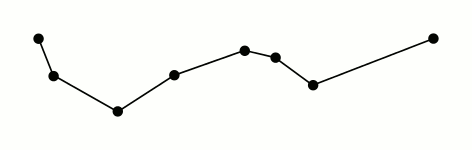

.. rdp documentation master file, created by
   sphinx-quickstart on Sat Oct  8 00:33:45 2016.
   You can adapt this file completely to your liking, but it should at least
   contain the root `toctree` directive.

Ramer-Douglas-Peucker Algorithm
===============================

The Ramer–Douglas–Peucker algorithm (RDP) is an algorithm for reducing the number of points in a curve that is approximated by a series of points.

Installation
============

The rdp package is available via pip::

    pip install rdp

Usage
=====

.. autofunction:: rdp.rdp

.. autofunction:: rdp.rdp_rec

.. autofunction:: rdp.rdp_iter

.. autofunction:: rdp.pldist

.. toctree::
   :maxdepth: 2
